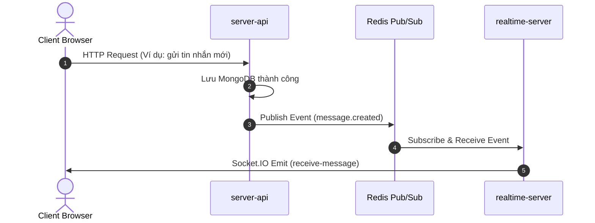

# Realtime Server - Handbook

Dịch vụ `realtime-server` chịu trách nhiệm xử lý các kết nối thời gian thực (realtime communication) thông qua Socket.IO và vận hành các tác vụ xử lý ngầm (background jobs) qua BullMQ cho ứng dụng Handbook. 

Dịch vụ này được thiết kế theo hướng bất đồng bộ (decoupled), **hoàn toàn không kết nối trực tiếp với Database**. Thay vào đó, nó tương tác với hệ thống qua cơ chế Event-Driven (Redis Pub/Sub) và REST API nội bộ của `server-api`.

---

## 📐 Kiến trúc & Luồng dữ liệu (Architecture & Data Flow)

Hệ thống hoạt động dựa trên sự tách biệt vai trò (Separation of Concerns) giữa REST API và Realtime Broadcast:



1. **`server-api`**: Là **Single Source of Truth** về dữ liệu. Mọi thay đổi dữ liệu phải thực hiện qua REST API. Sau khi lưu DB thành công, `server-api` sẽ publish sự kiện lên Redis Pub/Sub.
2. **`realtime-server`**: Đăng ký (Subscribe) các kênh trên Redis. Khi nhận sự kiện, nó sẽ phân phối và gửi (emit) dữ liệu qua các kết nối Socket.IO tới các client đang online hoặc các phòng chat thích hợp.
3. **API Client nội bộ**: Khi `realtime-server` cần truy vấn dữ liệu (ví dụ: lấy danh sách phòng chat của user khi họ mới kết nối), nó sẽ gọi ngược lại `server-api` thông qua các endpoint `/internal/realtime/...` được bảo mật bằng mã bí mật `x-internal-secret`.

---

## 📂 Cấu trúc dự án (Project Structure)

Thư mục nguồn `src/` được tổ chức như sau:

```
src/
├── common/
│   ├── config/
│   │   └── config.ts            # Quản lý cấu hình & biến môi trường
│   ├── constants/
│   │   ├── event-channels.ts    # Các kênh sự kiện Redis Pub/Sub
│   │   └── socket-events.ts     # Các hằng số sự kiện Socket.IO
│   ├── logger.ts                # Cấu hình Winston logger
│   └── types/
│       └── socket.ts            # Khai báo TypeScript types cho Socket
├── controllers/
│   └── internal.controller.ts   # Xử lý REST API nội bộ (emit events từ bên ngoài)
├── cron/
│   ├── cron.handler.ts          # Nơi kích hoạt tất cả cron jobs
│   └── heartbeat.cron.ts        # Cron dọn dẹp nhịp tim, cập nhật offline status
├── handlers/
│   ├── index.ts                 # Export tập trung các Socket handlers
│   ├── message.handler.ts       # Xử lý các sự kiện tin nhắn (Join, Leave, Send, Read...)
│   ├── notification.handler.ts  # Xử lý các sự kiện thông báo & lời mời kết bạn
│   ├── post.handler.ts          # Xử lý các sự kiện bài viết (Like bài viết)
│   └── videoCall.handler.ts     # Xử lý WebRTC Video/Audio Call signaling
├── middlwares/
│   └── auth.middleware.ts       # Middleware xác thực kết nối Socket qua JWT
├── queues/
│   └── email.worker.ts          # BullMQ Worker gửi email OTP ngầm (thông qua Resend)
├── routes/
│   └── internal.route.ts        # Định tuyến REST API nội bộ (/internal/events)
├── services/
│   ├── index.ts                 # Export tập trung các services
│   ├── api.service.ts           # Gọi REST API của server-api (decoupled DB)
│   ├── chat.service.ts          # Quản lý danh sách phòng & Socket ID trong phòng
│   ├── event.subscriber.ts      # Đăng ký & điều phối các sự kiện nhận từ Redis Pub/Sub
│   ├── redis.service.ts         # Khởi tạo và quản lý kết nối Redis
│   ├── user.service.ts          # Quản lý bộ ánh xạ user-socket và trạng thái online
│   └── videoCall.service.ts     # Quản lý các phiên cuộc gọi WebRTC (active calls)
├── utils/
│   ├── mail-templates.ts        # Các mẫu HTML email OTP đăng ký/reset pass
│   └── resend.ts                # Khởi tạo Resend API client
├── prepare.ts                   # Chuẩn bị hạ tầng (Redis, Cron, Call cleanups...)
└── server.ts                    # Entrypoint của dự án (Express, Socket.IO, BullMQ Worker)
```

---

## 🛠️ Cài đặt & Chạy dự án (Installation & Quickstart)

### 1. Yêu cầu hệ thống
- **Node.js**: >= 18
- **Redis Server**: Đang chạy (để xử lý Pub/Sub và BullMQ)

### 2. Cài đặt dependencies
```bash
npm install
```

### 3. Cấu hình biến môi trường
Tạo file `.env` từ file mẫu `.env.example`. Dưới đây là các biến môi trường được cấu hình tại `src/common/config/config.ts`:

| Biến môi trường | Ý nghĩa | Giá trị mặc định |
|---|---|---|
| `PORT` | Cổng hoạt động của realtime-server | `5000` |
| `CLIENT_HOST` | Danh sách domain client được phép kết nối (phân tách bằng dấu `,`) | `http://localhost:3000` |
| `INTERNAL_SECRET_KEY` | Khóa bí mật đồng bộ nội bộ giữa `server-api` và `realtime-server` | `default-secret-key-change-me` |
| `SERVER_API_URL` | URL API chính của `server-api` | `http://localhost:4000/api/v1` |
| `REDIS_URL` | Chuỗi kết nối Redis (URI) | `redis://localhost:6379` |
| `REDIS_HOST` | Host Redis (nếu không dùng REDIS_URL) | `localhost` |
| `REDIS_PORT` | Cổng Redis | `6379` |
| `REDIS_PASSWORD` | Mật khẩu kết nối Redis | `""` |
| `RESEND_API_KEY` | API Key của dịch vụ gửi email Resend | `""` |
| `RESEND_FROM_EMAIL` | Email người gửi được xác thực trên Resend | `onboarding@resend.dev` |

### 4. Chạy dự án
- **Chế độ Phát triển (Development)**:
  ```bash
  npm run dev
  ```
- **Xây dựng mã nguồn (Build)**:
  ```bash
  npm run build
  ```
- **Chạy chế độ Production**:
  ```bash
  npm start
  ```

---

## 📡 REST API & Socket Events Spec

### 1. REST API Nội bộ
- **`POST /internal/events`**
  - **Mục đích**: Nhận sự kiện trực tiếp từ dịch vụ khác (bằng cách gọi HTTP thay vì qua Redis).
  - **Headers**:
    - `x-internal-secret`: Giá trị khớp với `INTERNAL_SECRET_KEY` cấu hình trên server.
  - **Body**:
    ```json
    {
      "channel": "message.created",
      "data": { ... }
    }
    ```

### 2. Các kênh sự kiện Redis Pub/Sub (Event Channels)
Được cấu hình trong `src/common/constants/event-channels.ts`:
- `message.created`: Phát tin nhắn mới tới client trong phòng.
- `message.read`: Đồng bộ trạng thái đã đọc tin nhắn.
- `message.deleted`: Xóa tin nhắn realtime.
- `message.pinned` / `message.unpinned`: Ghim hoặc bỏ ghim tin nhắn.
- `notification.sent`: Gửi thông báo tới người dùng đích.
- `user.status.changed`: Thông báo cập nhật trạng thái người dùng thay đổi.
- `post.liked`: Thông báo khi có người dùng tương tác like bài viết.

### 3. Các sự kiện Socket.IO (Socket Events)
Được cấu hình trong `src/common/constants/socket-events.ts`:
- **Hệ thống**: `heartbeat` (client gửi định kỳ để duy trì trạng thái online).
- **Tin nhắn**: `join-room`, `leave-room`, `send-message`, `receive-message`, `read-message`, `delete-message`, `pin-message`, `un-pin-message`.
- **Thông báo**: `send-notification`, `receive-notification`, `send-request-add-friend`, `accept-friend`, `friend-online`.
- **Bài viết**: `like-post`.
- **Cuộc gọi Video (WebRTC)**: `video-call-initiate`, `video-call-accept`, `video-call-reject`, `video-call-end`, `video-call-offer`, `video-call-answer`, `video-call-ice-candidate`...

---

## 📧 BullMQ Background Workers
Dịch vụ khởi chạy một **BullMQ Worker** ngầm để lắng nghe queue `email-sending` từ Redis.
- **Mục đích**: Tách biệt tác vụ gửi mail OTP (vốn mất thời gian gọi bên thứ 3) ra khỏi luồng xử lý HTTP request chính của `server-api`.
- **Tích hợp**: Sử dụng dịch vụ **Resend** để gửi email OTP đăng ký hoặc đặt lại mật khẩu của người dùng.

---

## 📊 Giám sát & Metrics (Monitoring)
- **Prometheus Endpoint**: Truy cập `/metrics` để thu thập dữ liệu giám sát hiệu năng của Node.js runtime cũng như các thông số của hệ thống.
- **Graceful Shutdown**: Hệ thống bắt và xử lý triệt để các tín hiệu `SIGTERM`, `SIGINT` và `unhandledRejection` để đóng kết nối Redis, dừng BullMQ Workers và giải phóng các cổng kết nối một cách an toàn trước khi dừng ứng dụng.

---

## 🤝 Hướng dẫn phát triển & Đóng góp (Contributing Guidelines)

Khi phát triển hoặc sửa đổi tính năng liên quan đến Realtime / Background Job, hãy tuân thủ các quy tắc sau:

1. **Bảo mật**: Luôn kiểm tra JWT authentication của client kết nối. Các API kết nối nội bộ bắt buộc phải truyền và xác thực `x-internal-secret`.
2. **Quy trình thêm Socket Event**:
   - Thêm hằng số event vào `src/common/constants/socket-events.ts`.
   - Viết logic xử lý trong handler tương ứng thuộc `src/handlers/`.
   - Đăng ký lắng nghe sự kiện trong `SocketDispatcher` thuộc `src/socket/socket.dispatcher.ts`.
3. **Quy trình thêm Redis Pub/Sub Event**:
   - Thêm kênh và định nghĩa kiểu dữ liệu payload trong `src/common/constants/event-channels.ts`.
   - Viết hàm xử lý nhận tin trong `EventSubscriber` thuộc `src/services/event.subscriber.ts` và gắn vào hàm `dispatch()`.
4. **Không truy cập Database trực tiếp**: Tuyệt đối không import models hay kết nối trực tiếp database từ `realtime-server`. Mọi truy cập dữ liệu phải thực hiện thông qua việc gọi API sang `server-api` thông qua `apiService`.
